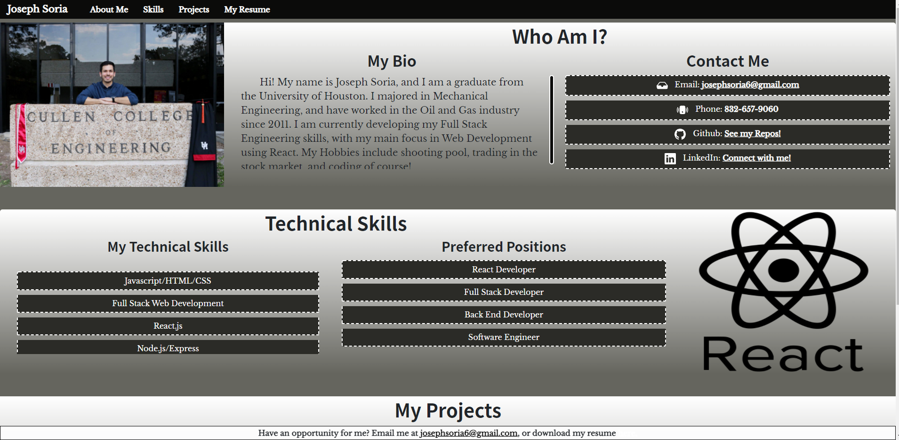
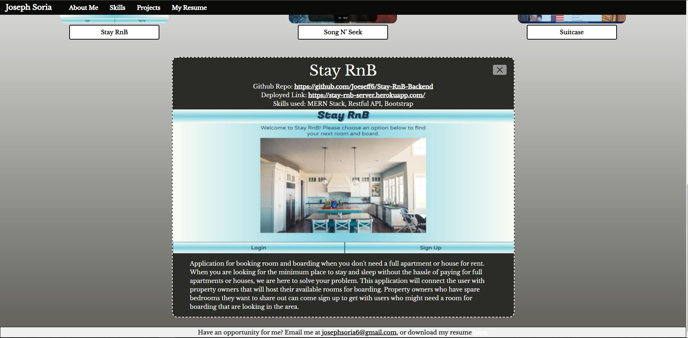

# React-Portfolio
My personal portfolio built using the React Library
## Link to Portfolio 🔗

_https://joseph-react-portfolio.netlify.app/_

## Table of Contents

1. [Project Description](#project-description)
2. [Tech Stack](#Tech-Stack)
3. [Screenshots](#Screenshots)

## Project Description 

This project is simply my professional portfolio, which is built using React. This is a comparison to my previous portfolio project, where I used Bootstrap to achieve a responsive web page. This page is an actual application, as it has button functionality to add a little magic to my portfolio!

I used function components to build this portfolio, which was helpful in terms of re-using interactions throughout the application. This was a lot of work to start up, but once my components where made, I was able to freely use them all over my portfolio! A couple components I made include a navigation bar and footer, a header, containers for my projects and images (separately), and a list. My projects and lists toggle display by button-click, which was easily achievable using React hooks.

## Tech Stack

* HTML5
* CSS3
* Javascript
* Node.js
* React

## Screenshots

